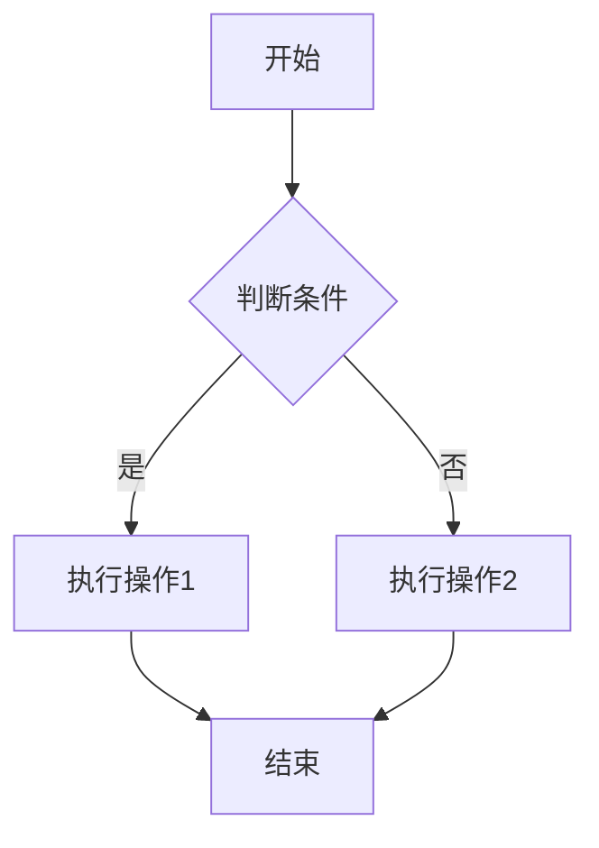
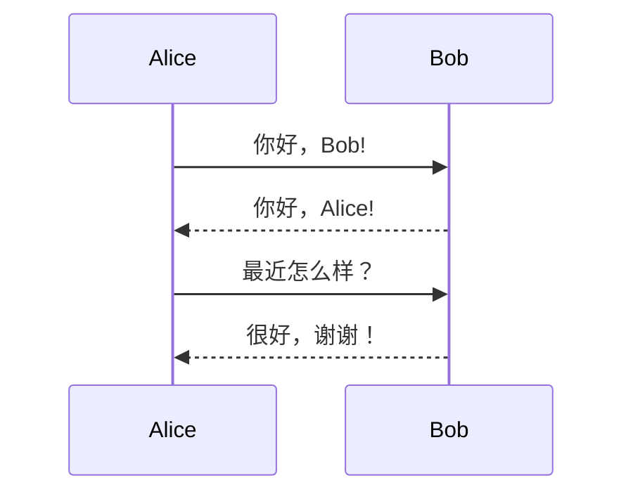
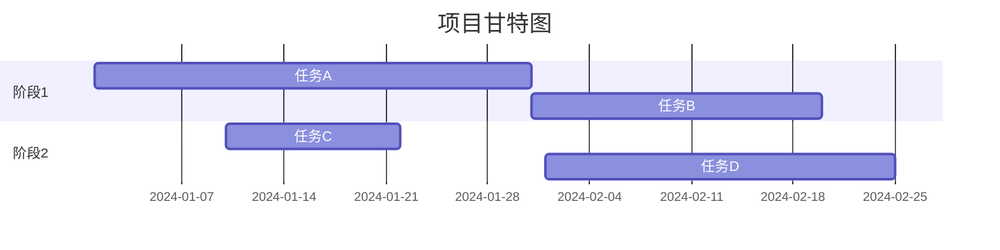
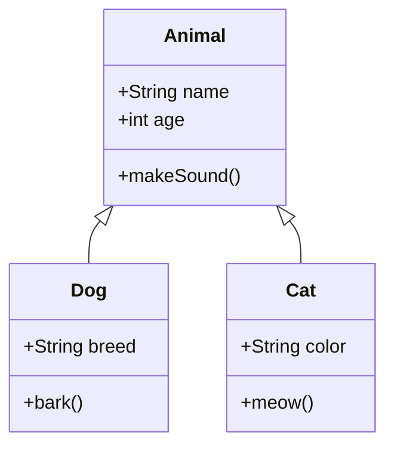

# al-folio 博客写作指南

> 本指南基于 [al-folio](https://github.com/alshedivat/al-folio) 模板，汇总了所有示例文章中的写作技巧和语法，供个人博客写作参考。

---

## 目录

- [Front Matter 配置](#front-matter-配置)
  - [博客文章 Front Matter](#博客文章-front-matter)
  - [项目页面 Front Matter](#项目页面-front-matter)
  - [Distill 风格文章 Front Matter](#distill-风格文章-front-matter)
- [基础 Markdown 语法](#基础-markdown-语法)
  - [文本格式化](#文本格式化)
  - [列表](#列表)
  - [链接](#链接)
  - [引用块](#引用块)
- [高级功能](#高级功能)
  - [数学公式](#数学公式)
  - [代码块](#代码块)
  - [图片](#图片)
  - [表格](#表格)
  - [视频](#视频)
  - [音频](#音频)
- [专业可视化](#专业可视化)
  - [Mermaid 图表](#mermaid-图表)
  - [Chart.js 图表](#chartjs-图表)
  - [ECharts 图表](#echarts-图表)
  - [Vega-Lite 可视化](#vega-lite-可视化)
  - [GeoJSON 地图](#geojson-地图)
  - [TikZ 绘图](#tikz-绘图)
  - [Typograms](#typograms)
- [特殊功能](#特殊功能)
  - [自定义引用块](#自定义引用块)
  - [标签页](#标签页)
  - [目录](#目录)
  - [代码差异显示](#代码差异显示)
  - [伪代码](#伪代码)
  - [Jupyter Notebook](#jupyter-notebook)
  - [参考文献](#参考文献)
  - [照片画廊](#照片画廊)

---

## Front Matter 配置

### 博客文章 Front Matter

每篇博客文章都需要在文件开头包含 Front Matter（用 `---` 包裹的 YAML 配置）。

#### 基础配置

```yaml
---
layout: post # 布局类型：post
title: 文章标题 # 文章标题
date: 2024-01-27 11:46:00 # 发布日期和时间
description: 文章简短描述 # 文章描述（SEO 友好）
tags: formatting images # 标签（空格分隔）
categories: sample-posts # 分类
---
```

#### 常用可选配置

```yaml
---
# 显示相关选项
featured: true # 是否在首页突出显示
thumbnail: assets/img/9.jpg # 缩略图路径
related_posts: true # 显示相关文章
giscus_comments: true # 启用 Giscus 评论系统

# 参考文献
related_publications: true # 显示相关出版物
bibliography: 2018-12-22-distill.bib # 指定参考文献文件

# 特殊功能启用标志
pretty_table: true # 美化表格样式
tabs: true # 启用标签页功能
pseudocode: true # 启用伪代码渲染
code_diff: true # 启用代码差异显示
map: true # 启用地图功能
tikzjax: true # 启用 TikZ 绘图
typograms: true # 启用 Typograms

# Mermaid 图表配置
mermaid:
  enabled: true # 启用 Mermaid
  zoomable: true # 图表可缩放

# 图表库配置
chart:
  chartjs: true # 启用 Chart.js
  echarts: true # 启用 ECharts
  vega_lite: true # 启用 Vega-Lite

# 图片库配置
images:
  compare: true # 启用图片对比滑块
  slider: true # 启用图片轮播
  lightbox2: true # 启用 Lightbox2 画廊
  photoswipe: true # 启用 PhotoSwipe 画廊
  spotlight: true # 启用 Spotlight 画廊
  venobox: true # 启用 Venobox 画廊

# 目录配置
toc:
  sidebar: left # 侧边栏目录（left/right）
---
```

### 项目页面 Front Matter

```yaml
---
layout: page # 页面布局
title: 项目名称 # 项目标题
description: 项目简短描述 # 项目描述
img: assets/img/12.jpg # 项目封面图片
importance: 1 # 重要性排序（数字越小越靠前）
category: work # 项目分类（work/fun）
related_publications: true # 显示相关出版物
---
```

### Distill 风格文章 Front Matter

Distill 是一种学术风格的博客布局，适合展示研究性内容。

```yaml
---
layout: distill # 使用 distill 布局
title: 文章标题 # 标题
description: 文章描述 # 描述
tags: distill formatting # 标签
giscus_comments: true # 评论
date: 2021-05-22 # 日期
featured: true # 特色文章

# 作者信息（可多人）
authors:
  - name: Albert Einstein
    url: "https://en.wikipedia.org/wiki/Albert_Einstein"
    affiliations:
      name: IAS, Princeton
  - name: Boris Podolsky
    url: "https://en.wikipedia.org/wiki/Boris_Podolsky"
    affiliations:
      name: IAS, Princeton

# 参考文献
bibliography: 2018-12-22-distill.bib

# 目录（手动指定）
toc:
  - name: Equations
  - name: Citations
  - name: Footnotes
  - name: Code Blocks

# 自定义样式
_styles: >
  .fake-img {
    background: #bbb;
    border: 1px solid rgba(0, 0, 0, 0.1);
  }
---
```

---

## 基础 Markdown 语法

### 文本格式化

```markdown
# 一级标题

## 二级标题

### 三级标题

#### 四级标题

**粗体文本** 或 **粗体文本**
_斜体文本_ 或 _斜体文本_
**粗体和 _斜体_ 组合**
~~删除线~~

## 水平分隔线：

或

---
```

### 列表

#### 无序列表

```markdown
- 项目 1
- 项目 2
  - 子项目 2.1
  - 子项目 2.2
- 项目 3
```

#### 有序列表

```markdown
1. 第一项
2. 第二项
3. 第三项
   1. 子项 3.1
   2. 子项 3.2
```

#### 任务列表（Checklist）

```markdown
- [x] 已完成任务
- [ ] 未完成任务
  - [x] 子任务已完成
  - [ ] 子任务未完成
- [x] 另一个已完成任务
```

### 链接

```markdown
# 行内链接

[链接文字](https://www.example.com)
[带标题的链接](https://www.example.com "鼠标悬停时显示")

# HTML 链接（在新标签页打开）

<a href="https://www.example.com" target="_blank">外部链接</a>

# 参考式链接

[链接文字][reference]
[reference]: https://www.example.com

# 自动链接

<https://www.example.com>
```

### 引用块

#### 普通引用

```markdown
> 这是一段引用文字。
> 可以包含多行。
>
> — 作者名
```

效果：

> 这是一段引用文字。
> 可以包含多行。
>
> — 作者名

---

## 高级功能

### 数学公式

al-folio 使用 [MathJax 3](https://www.mathjax.org/) 引擎渲染数学公式。

#### 行内公式

```markdown
使用 `$$` 包裹公式：$$ E = mc^2 $$

或使用单个 `$`（略显不明显）：$ E = mc^2 $
```

效果：质能方程 $$ E = mc^2 $$ 是物理学的基础。

#### 独立公式（Display Mode）

```markdown
$$
\sum_{k=1}^\infty |\langle x, e_k \rangle|^2 \leq \|x\|^2
$$
```

#### 带编号的公式

```markdown
\begin{equation}
\label{eq:cauchy-schwarz}
\left( \sum*{k=1}^n a_k b_k \right)^2 \leq \left( \sum*{k=1}^n a*k^2 \right) \left( \sum*{k=1}^n b_k^2 \right)
\end{equation}

使用 `\eqref{eq:cauchy-schwarz}` 引用公式。
```

### 代码块

#### 基础代码块

````markdown
```python
def hello_world():
    print("Hello, World!")
    return True
```
````

#### 带行号的代码块

需要在 Front Matter 中配置或使用 liquid 标签：

```liquid


def factorial(n):
    if n == 0:
        return 1
    return n * factorial(n - 1)


```

#### 列表中的代码块

在列表中使用代码块时，需要注意缩进（3 × 列表层级数）：

````markdown
1. 第一项内容

   ```python
   print("代码块在列表中")
   ```
````

2. 第二项内容

````

### 图片

#### 基础图片语法

```markdown


````

#### 使用 figure.liquid（推荐）

```liquid



```

参数说明：

- `loading="eager"` 或 `"lazy"` - 图片加载策略
- `path` - 图片路径
- `class` - CSS 类名
  - `img-fluid` - 响应式图片
  - `rounded` - 圆角
  - `z-depth-1` - 阴影效果
- `zoomable=true` - 点击可放大

#### 图片网格布局

使用 Bootstrap 网格系统创建图片布局：

```html
<div class="row mt-3">
  <div class="col-sm mt-3 mt-md-0"></div>
  <div class="col-sm mt-3 mt-md-0"></div>
  <div class="col-sm mt-3 mt-md-0"></div>
</div>
<div class="caption">图片说明文字放在这里。</div>
```

#### 2/3 + 1/3 布局

```html
<div class="row justify-content-sm-center">
  <div class="col-sm-8 mt-3 mt-md-0"></div>
  <div class="col-sm-4 mt-3 mt-md-0"></div>
</div>
```

#### 图片轮播（Image Slider）

需要在 Front Matter 中启用：`images.slider: true`

```html
<swiper-container keyboard="true" navigation="true" pagination="true" pagination-clickable="true" pagination-dynamic-bullets="true" rewind="true">
  <swiper-slide></swiper-slide>
  <swiper-slide></swiper-slide>
  <swiper-slide></swiper-slide>
</swiper-container>
```

#### 图片对比滑块

需要在 Front Matter 中启用：`images.compare: true`

```html

   
</img-comparison-slider>
```

### 表格

#### Markdown 表格

需要在 Front Matter 中启用：`pretty_table: true`

```markdown
| 左对齐列 | 居中对齐列 | 右对齐列 |
| :------- | :--------: | -------: |
| 左 1     |    中 1    |     右 1 |
| 左 2     |    中 2    |     右 2 |
| 左 3     |    中 3    |     右 3 |
```

#### Bootstrap Table（高级表格）

从 JSON 文件加载数据：

```html

<table id="table" data-toggle="table" data-url="{{ '/assets/json/table_data.json' | relative_url }}">
  <thead>
    <tr>
      <th data-field="id">ID</th>
      <th data-field="name">名称</th>
      <th data-field="price">价格</th>
    </tr>
  </thead>
</table>

```

#### 带分页、搜索、排序的表格

```html
<table
  data-click-to-select="true"
  data-height="460"
  data-pagination="true"
  data-search="true"
  data-toggle="table"
  data-url="{{ '/assets/json/table_data.json' | relative_url }}"
>
  <thead>
    <tr>
      <th data-checkbox="true"></th>
      <th data-field="id" data-halign="left" data-align="center" data-sortable="true">ID</th>
      <th data-field="name" data-halign="center" data-align="right" data-sortable="true">名称</th>
      <th data-field="price" data-halign="right" data-align="left" data-sortable="true">价格</th>
    </tr>
  </thead>
</table>
```

### 视频

#### 本地视频

```liquid

<div class="row mt-3">
    <div class="col-sm mt-3 mt-md-0">
        
    </div>
</div>

```

#### YouTube 视频嵌入

```liquid



```

#### Vimeo 视频嵌入

```liquid



```

### 音频

待补充（参考 `_posts/2023-04-25-audios.md`）

---

## 专业可视化

### Mermaid 图表

需要在 Front Matter 中启用：

```yaml
mermaid:
  enabled: true
  zoomable: true
```

#### 流程图

````markdown

````

#### 时序图

````markdown

````

#### 甘特图

````markdown

````

#### 类图

````markdown

````

### Chart.js 图表

需要在 Front Matter 中启用：

```yaml
chart:
  chartjs: true
```

#### 折线图

````markdown
```chartjs
{
  "type": "line",
  "data": {
    "labels": ["一月", "二月", "三月", "四月", "五月", "六月"],
    "datasets": [{
      "label": "销售额",
      "data": [65, 59, 80, 81, 56, 55],
      "fill": false,
      "borderColor": "rgba(75,192,192,1)"
    }]
  },
  "options": {}
}
```
````

#### 柱状图

````markdown
```chartjs
{
  "type": "bar",
  "data": {
    "labels": ["2020", "2021", "2022", "2023"],
    "datasets": [{
      "label": "用户数量",
      "data": [12, 19, 3, 5],
      "backgroundColor": "rgba(54, 162, 235, 0.6)"
    }]
  }
}
```
````

#### 饼图

````markdown
```chartjs
{
  "type": "doughnut",
  "data": {
    "labels": ["红色", "蓝色", "黄色"],
    "datasets": [{
      "data": [300, 50, 100],
      "backgroundColor": ["#FF6384", "#36A2EB", "#FFCE56"]
    }]
  }
}
```
````

### ECharts 图表

需要在 Front Matter 中启用：

```yaml
chart:
  echarts: true
```

````markdown
```echarts
{
  "title": {
    "text": "月度销售对比",
    "left": "center"
  },
  "tooltip": {
    "trigger": "axis"
  },
  "legend": {
    "data": ["产品A", "产品B"],
    "top": "10%"
  },
  "xAxis": {
    "type": "category",
    "data": ["一月", "二月", "三月", "四月", "五月", "六月"]
  },
  "yAxis": {
    "type": "value"
  },
  "series": [
    {
      "name": "产品A",
      "type": "line",
      "data": [820, 932, 901, 934, 1290, 1330]
    },
    {
      "name": "产品B",
      "type": "line",
      "data": [620, 732, 701, 734, 1090, 1130]
    }
  ]
}
```
````

### Vega-Lite 可视化

需要在 Front Matter 中启用：

```yaml
chart:
  vega_lite: true
```

````markdown
```vega_lite
{
  "$schema": "https://vega.github.io/schema/vega/v5.json",
  "width": 400,
  "height": 200,
  "data": [
    {
      "name": "table",
      "values": [
        {"category": "A", "value": 28},
        {"category": "B", "value": 55},
        {"category": "C", "value": 43}
      ]
    }
  ],
  "scales": [
    {
      "name": "xscale",
      "type": "band",
      "domain": {"data": "table", "field": "category"},
      "range": "width"
    },
    {
      "name": "yscale",
      "domain": {"data": "table", "field": "value"},
      "range": "height"
    }
  ]
}
```
````

### GeoJSON 地图

需要在 Front Matter 中启用：`map: true`

````markdown
```geojson
{
  "type": "FeatureCollection",
  "features": [
    {
      "type": "Feature",
      "properties": {
        "name": "区域名称",
        "popupContent": "弹出内容"
      },
      "geometry": {
        "type": "Polygon",
        "coordinates": [
          [
            [经度1, 纬度1],
            [经度2, 纬度2],
            [经度3, 纬度3],
            [经度1, 纬度1]
          ]
        ]
      }
    }
  ]
}
```
````

### TikZ 绘图

需要在 Front Matter 中启用：`tikzjax: true`

```html
<script type="text/tikz">
  \begin{tikzpicture}
      \draw[thick, ->] (0,0) -- (2,0) node[right] {$x$};
      \draw[thick, ->] (0,0) -- (0,2) node[above] {$y$};
      \draw[blue, thick] (0,0) circle (1cm);
      \node at (1.2, 1.2) {圆形};
  \end{tikzpicture}
</script>
```

### Typograms

需要在 Front Matter 中启用：`typograms: true`

````markdown
```typograms
+----------------+
|                |
|    标题框      |
|                |
+----------------+
        |
        v
+----------------+
|    内容框      |
+----------------+
```
````

---

## 特殊功能

### 自定义引用块

#### TIP（提示）

```markdown
> ##### TIP
>
> 这里是提示内容，用于给读者提供建议。
> {: .block-tip }
```

#### WARNING（警告）

```markdown
> ##### WARNING
>
> 这是警告内容，需要读者特别注意。
> {: .block-warning }
```

#### DANGER（危险）

```markdown
> ##### DANGER
>
> 这是危险提示，表示可能造成严重后果。
> {: .block-danger }
```

### 标签页

需要在 Front Matter 中启用：`tabs: true`

```liquid




标签1的内容



标签2的内容



标签3的内容




```

示例：代码对比

````liquid




```python print("Hello, World!")
````





```javascript
console.log("Hello, World!");
```





```java
System.out.println("Hello, World!");
```






````

### 目录

#### 侧边栏目录

在 Front Matter 中配置：

```yaml
toc:
  sidebar: left  # 或 right
````

目录会自动从文章标题生成。

#### 自定义目录项文字

```markdown
## 自定义标题

{:data-toc-text="目录中显示的文字"}
```

### 代码差异显示

需要在 Front Matter 中启用：`code_diff: true`

#### 简单 diff

````markdown
```diff
diff --git a/sample.js b/sample.js
index 0000001..0ddf2ba
--- a/sample.js
+++ b/sample.js
@@ -1 +1 @@
-console.log("Hello World!")
+console.log("Hello from Diff!")
```
````

#### diff2html（美化版）

````markdown
```diff2html
diff --git a/file.js b/file.js
index 1234567..abcdefg 100644
--- a/file.js
+++ b/file.js
@@ -1,5 +1,5 @@
 function example() {
-    console.log("旧代码");
+    console.log("新代码");
     return true;
 }
```
````

### 伪代码

需要在 Front Matter 中启用：`pseudocode: true`

**注意**：在伪代码中，所有 `$` 需要替换为 `$$`。

````markdown
```pseudocode
\begin{algorithm}
\caption{快速排序算法}
\begin{algorithmic}
\PROCEDURE{Quicksort}{$$A, p, r$$}
    \IF{$$p < r$$}
        \STATE $$q = $$ \CALL{Partition}{$$A, p, r$$}
        \STATE \CALL{Quicksort}{$$A, p, q - 1$$}
        \STATE \CALL{Quicksort}{$$A, q + 1, r$$}
    \ENDIF
\ENDPROCEDURE
\end{algorithmic}
\end{algorithm}
```
````

### Jupyter Notebook

将 `.ipynb` 文件放在 `assets/jupyter/` 目录下，然后在文章中嵌入：

```liquid

{::nomarkdown}



  

  <p>抱歉，找不到该 notebook 文件。</p>

{:/nomarkdown}

```

### 参考文献

#### 简单引用

需要在 Front Matter 中启用：`related_publications: true`

```liquid

简单引用：

多个引用：

完整引用：

```

#### 引用块

```liquid


这里是引用的内容。
可以包含多段文字。


```

### 照片画廊

需要在 Front Matter 中启用相应的库：

```yaml
images:
  lightbox2: true
  photoswipe: true
  spotlight: true
  venobox: true
```

#### Lightbox2

```html
<a href="图片大图URL" data-lightbox="gallery-name">
  
</a>
```

#### PhotoSwipe

```html
<div class="pswp-gallery" id="my-gallery">
  <a href="图片URL" data-pswp-width="1920" data-pswp-height="1080" target="_blank">
    
  </a>
</div>
```

#### Spotlight

```html
<div class="spotlight-group">
  <a class="spotlight" href="图片1URL">
    
  </a>
  <a class="spotlight" href="图片2URL">
    
  </a>
</div>
```

---

## 文件组织建议

### 目录结构

```
stibiums.github.io/
├── _posts/                    # 博客文章
│   └── 2024-01-27-title.md
├── _projects/                 # 项目页面
│   └── project-name.md
├── _bibliography/             # 参考文献
│   └── papers.bib
├── assets/
│   ├── img/                  # 图片
│   ├── video/                # 视频
│   ├── audio/                # 音频
│   ├── pdf/                  # PDF 文件
│   ├── jupyter/              # Jupyter notebooks
│   └── json/                 # JSON 数据文件
└── AL-FOLIO_WRITING_GUIDE.md # 本指南
```

### 文章命名规范

博客文章应遵循以下命名格式：

```
YYYY-MM-DD-title.md
```

例如：`2024-01-27-my-first-post.md`

### 图片资源管理

建议按项目或文章组织图片：

```
assets/
├── img/
│   ├── posts/
│   │   ├── 2024-01-27-post1/
│   │   └── 2024-02-01-post2/
│   └── projects/
│       ├── project1/
│       └── project2/
```

---

## 最佳实践

### 1. 性能优化

- 图片使用 `loading="lazy"` 延迟加载（首屏图片除外）
- 大图片压缩后再上传
- 视频优先使用外部嵌入（YouTube、Vimeo）

### 2. SEO 优化

- 每篇文章都写清晰的 `description`
- 使用合适的 `tags` 和 `categories`
- 图片添加 `alt` 文本

### 3. 可读性

- 使用适当的标题层级（不要跳级）
- 代码块指定语言以获得语法高亮
- 长文章使用目录（TOC）
- 适当使用引用块和提示框

### 4. 可维护性

- 图片、视频等资源使用相对路径
- 复杂的可视化数据存储在单独的 JSON 文件中
- 参考文献统一管理在 `_bibliography` 目录

---

## 常见问题

### 如何在文章中使用 emoji？

直接输入 emoji 字符即可：😊 🎉 🚀

### 如何让图片并排显示？

使用 Bootstrap 的网格系统（参见 [图片网格布局](#图片网格布局)）。

### 数学公式不显示怎么办？

确保公式语法正确，使用 `$$` 包裹（LaTeX 语法）。

### 代码块在列表中不正确显示？

确保代码块的缩进是列表层级数的 3 倍（参见 [列表中的代码块](#列表中的代码块)）。

### Mermaid 图表不显示？

检查 Front Matter 中是否启用了 `mermaid.enabled: true`。

---

## 参考资源

- **al-folio 官方文档**: https://github.com/alshedivat/al-folio
- **Jekyll 文档**: https://jekyllrb.com/docs/
- **Markdown 语法**: https://www.markdownguide.org/
- **Bootstrap 文档**: https://getbootstrap.com/docs/
- **MathJax 文档**: https://docs.mathjax.org/
- **Mermaid 文档**: https://mermaid.js.org/
- **Chart.js 文档**: https://www.chartjs.org/docs/

---

**最后更新**: 2024-01-27

祝你写作愉快！✨
